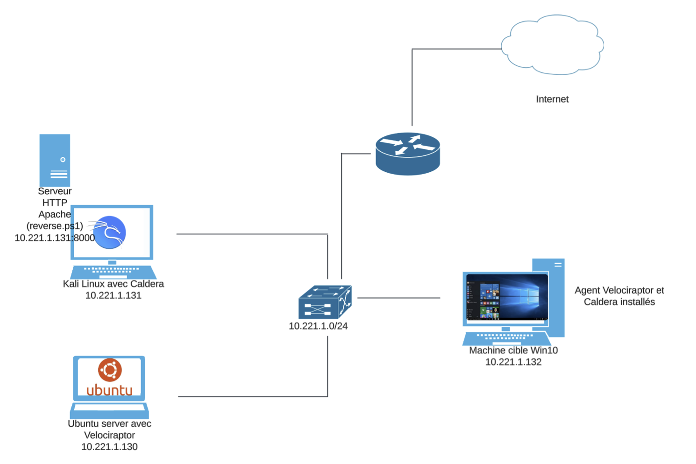

# Architecture Réseau - Simulation d'attaque et de détection

Ce document décrit l'architecture réseau utilisée pour notre environnement de test dans le cadre du projet de simulation d'une attaque avec **Caldera** et détection avec **Velociraptor**.

## 🔧 Topologie du réseau

Le réseau est configuré en **classe C privée**, avec une plage d’adresses locale `10.221.1.0/24`.

### 🧭 Composants principaux

#### 1. Kali Linux avec Caldera
- **Adresse IP** : `10.221.1.130`
- **Rôle** : Serveur de commande et de contrôle (C2) utilisant l’outil Caldera.
- **Fonctions** :
  - Génération de scripts malveillants (`reverse.ps1`)
  - Lancement d'opérations d'attaque automatisées.
  - Serveur HTTP (port 8000) pour héberger les payloads.

#### 2. Serveur Ubuntu avec Velociraptor
- **Adresse IP** : `10.221.1.131`
- **Rôle** : Console de détection et de réponse (Blue Team).
- **Fonctions** :
  - Collecte de données forensiques.
  - Détection d’activités suspectes (ex. reverse shell, persistence...).
  - Analyse des artefacts réseau/système.

#### 3. Machine cible Windows 10
- **Adresse IP** : `10.221.1.132`
- **Rôle** : Cible de l'attaque.
- **Logiciels installés** :
  - Agent Velociraptor
  - Agent Caldera (lancé via un script malveillant)

## 🌐 Connexions réseau

Tous les hôtes sont connectés au même sous-réseau `10.221.1.0/24`, leur permettant de communiquer directement sans routage complexe.

Le trafic Internet est simulé par la passerelle réseau, utile pour tester l’exfiltration de données ou les connexions sortantes depuis les payloads.

## 🛠️ Objectifs pédagogiques

- Simuler une attaque post-exploitation avec Caldera (exécution de scripts PowerShell, persistance, reconnaissance réseau).
- Détecter ces activités avec Velociraptor.
- Élaborer des rapports de détection et une réponse à incident complète.

## 📸 Schéma visuel de l’architecture

 utilisant l’outil Caldera.
- **Fonctions** :
  - Génération de scripts malveillants (`reverse.ps1`)
  - Lancement d'opérations d'attaque automatisées.
  - Serveur HTTP (port 8000) pour héberger les payloads.

#### 2. Serveur Ubuntu avec Velociraptor
- **Adresse IP** : `10.221.1.131`
- **Rôle** : Console de détection et de réponse (Blue Team).
- **Fonctions** :
  - Collecte de données forensiques.
  - Détection d’activités suspectes (ex. reverse shell, persistence...).
  - Analyse des artefacts réseau/système.

#### 3. Machine cible Windows 10
- **Adresse IP** : `10.221.1.132`
- **Rôle** : Cible de l'attaque.
- **Logiciels installés** :
  - Agent Velociraptor
  - Agent Caldera (lancé via un script malveillant)

## 🌐 Connexions réseau

Tous les hôtes sont connectés au même sous-réseau `10.221.1.0/24`, leur permettant de communiquer directement sans routage complexe.

Le trafic Internet est simulé par la passerelle réseau, utile pour tester l’exfiltration de données ou les connexions sortantes depuis les payloads.

## 🛠️ Objectifs pédagogiques

- Simuler une attaque post-exploitation avec Caldera (exécution de scripts PowerShell, persistance, reconnaissance réseau).
- Détecter ces activités avec Velociraptor.
- Élaborer des rapports de détection et une réponse à incident complète.

## 📸 Schéma visuel de l’architecture

---

